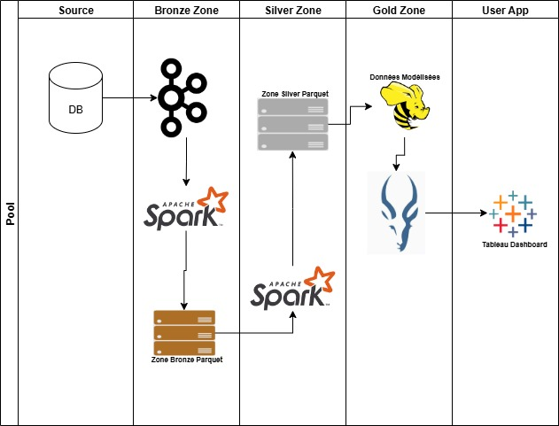
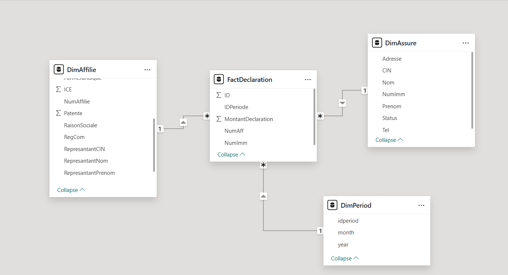
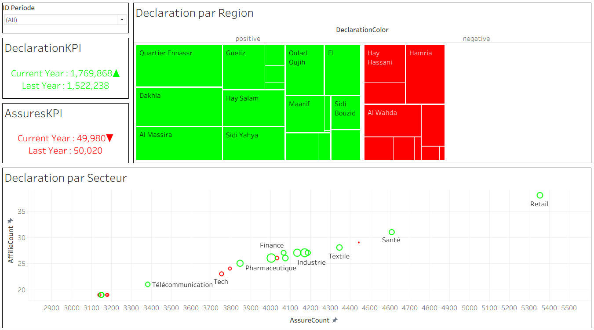
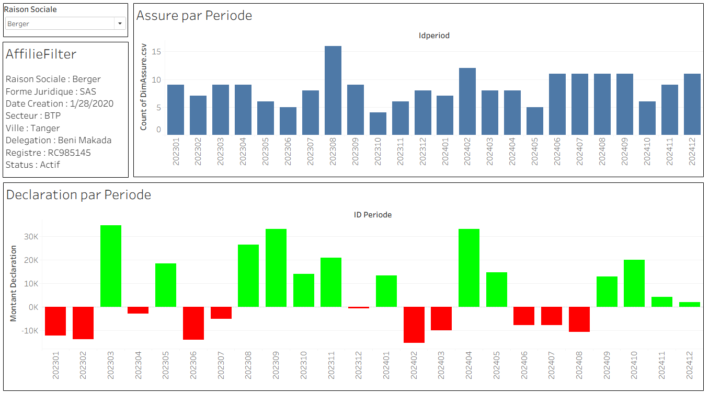

# BigDataPlatform – Hadoop-Based Analytical Platform

## Project Summary
This project consists of building a Big Data Platform based on the Hadoop ecosystem in order to support large-scale data ingestion, processing, storage, warehousing, and analytical visualization. The goal of the platform is to simulate real-world big data engineering architecture while validating end-to-end data flow and analytical capability using distributed processing frameworks.

---

## Technology Stack

| Layer                  | Component    |
|------------------------|--------------|
| Data Ingestion         | Apache Kafka |
| Distributed Processing | Apache Spark |
| Distributed Storage    | HDFS         |
| Data Warehousing       | Apache Hive  |
| Data Analytics         | Tableau      |

---

## Platform Architecture
The platform follows a modular big data pipeline where data is produced, ingested, processed, stored, modeled, and analyzed through an analytics tool.

---

## Data Model
A dimensional modeling approach is used for analytical warehouse design. The schema stores fact records processed through Spark and materialized into Hive tables for analytical queries.

This project uses dummy data for simulation purposes only, in order to evaluate the operational validity of the platform, ingestion flow, processing logic, and analytical execution.

---

## Dashboards (Tableau)

Two Tableau dashboard pages are developed to validate analytical usage and query performance from the data warehouse.

